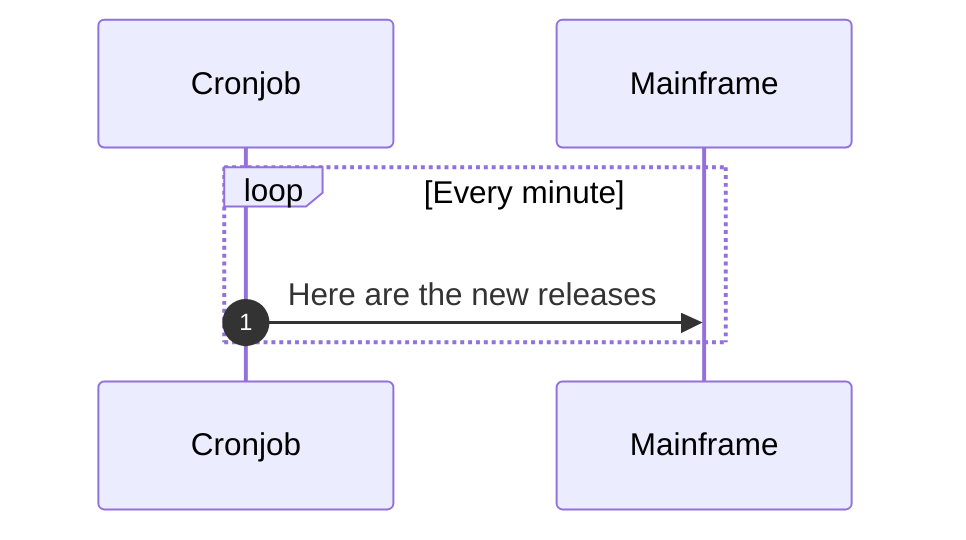
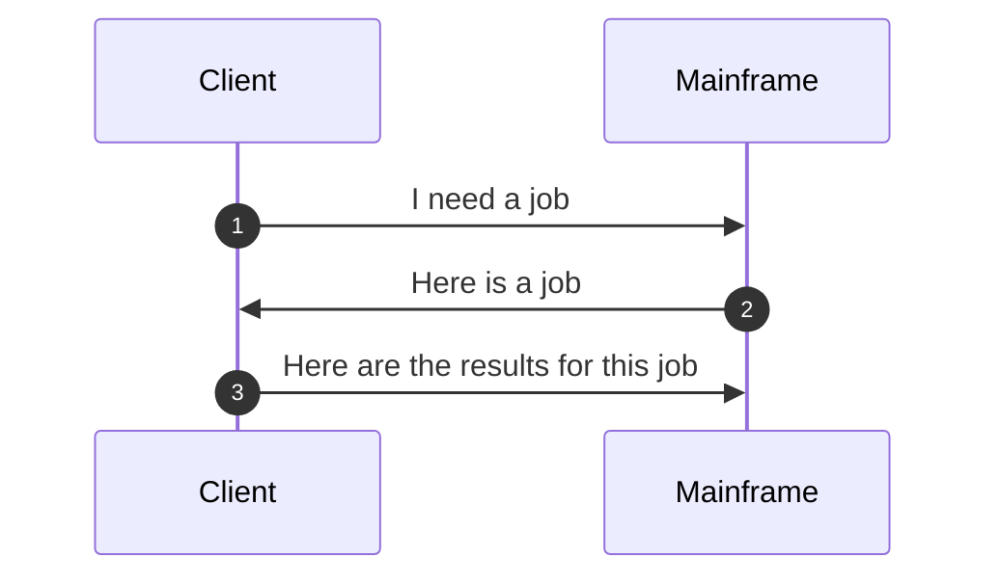
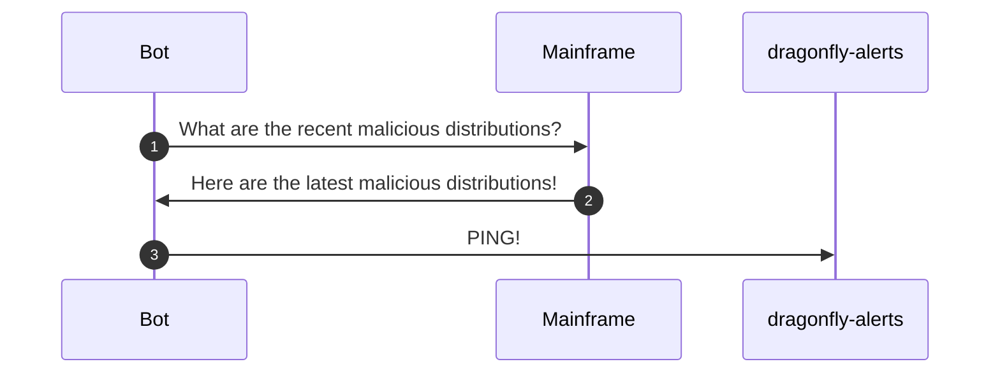
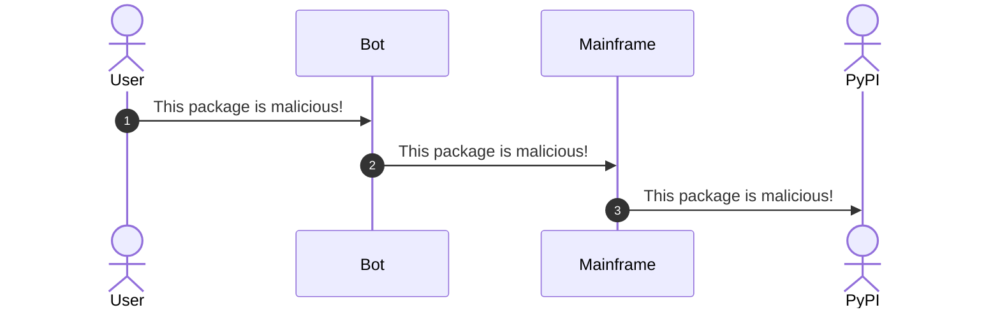

# Overview

Dragonfly consists of a few main components: the mainframe, the cronjob, the client, and the Discord bot.

## Components

### Cronjob

The cronjob is responsible for periodically checking PyPI for new releases and sending them to the mainframe to stage for analysis.
The Mainframe is responsible for making sure that it doesn't process the same release twice.

### Clients

Clients request a job (a package to scan) from the Mainframe, analyze the package, and send the results back to the Mainframe.

### Discord bot

Every few minutes, the Discord bot will request the latest malicious distributions from the Mainframe and post them to the #dragonfly-alerts channel.

### User confirmation and reporting

The bot creates an embed in the #dragonfly-alerts channel for each malicious package.
Users can click the "report" button to confirm that the package is malicious, and report it to PyPI.

